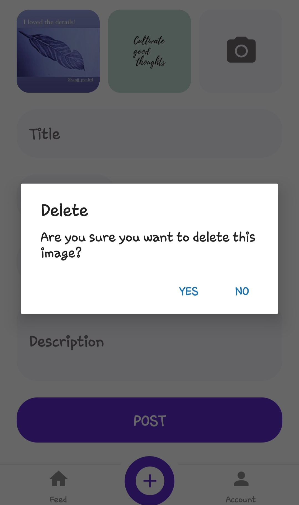

# SELLEY

A Marketplace app for the stuff you don't need anymore.

React-Native app using expo-cli, Yup and Formik forms, apisauce linked to a node backend server. An offline support, data stored in cache, modulable components hooks and personalised routes. Animations with Lottie. Authentication, login/register, navigable screens and notifications.

---

## Sreenshots of the Selley Application

---

# Setup of the project

Click here for :- [Backend of the Project](https://github.com/himansh-gjr/SELLEY-Backend---Node)

This project is created using expo https://docs.expo.io

make sure you have expo-cli installed, if not then install by using following cmd

install the command line tools for expo `npm install --global expo-cli`

After installing expo-cli install dependencies and run the project

To install dependencies `npm i`

start the server by `expo start` or `npm start`
